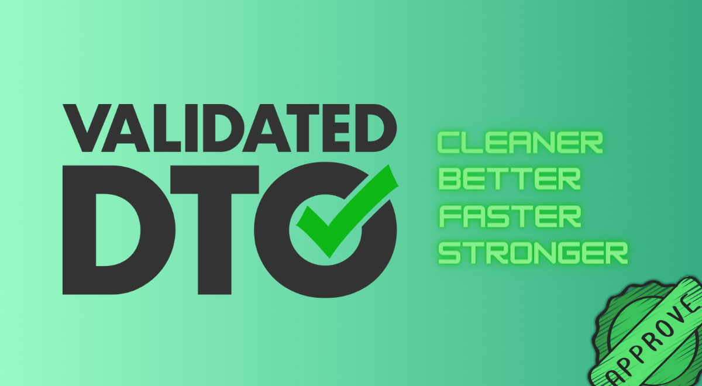

# ✅ Validated DTO for Laravel

### &#x20;

<figure><figcaption></figcaption></figure>

### Features 

* Easily integrate it with your current project
* Data validation the same way you validate a **Request**
* Use the DTO the same way you use a **Form Request** in your controllers
* Easily define **custom validation messages**
* Support for **typed properties**
* **Type Casting** out-of-the-box for your DTOs properties
* Support casting of **nested data**
* Easily create **custom Type Casters** for your own needs
* Custom data mapping
* Use DTOs for wrapping, typing and transforming API responses
* [**Laravel Livewire**](https://livewire.laravel.com/) support

### Why use this package

**Data Transfer Objects (DTOs)** are objects that are used to transfer data between systems. **DTOs** are typically used in applications to provide a simple, consistent format for transferring data between different parts of the application, such as **between the user interface and the business logic**.

This package provides a base **DTO Class** that can **validate** the data when creating a **DTO**. But why should we do this instead of using the standard **Request** validation?

Imagine that now you want to do the same action that you do in an endpoint on a **CLI** command per example. If your validation is linked to the Request you'll have to implement the same validation again.

With this package you **define the validation once** and can **reuse it where you need**, making your application more **maintainable** and **decoupled**.

## Credits

* [Wendell Adriel](https://github.com/WendellAdriel)
* [All Contributors](https://github.com/WendellAdriel/laravel-validated-dto/graphs/contributors)

## Contributing

All PRs are welcome.

For major changes, please open an issue first describing what you want to add/change.
